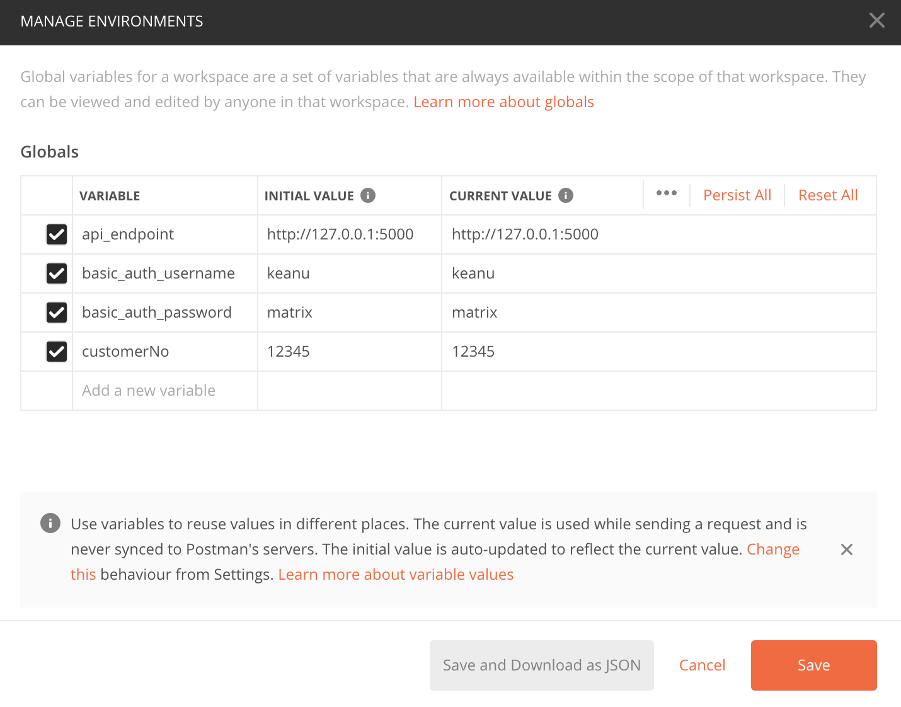
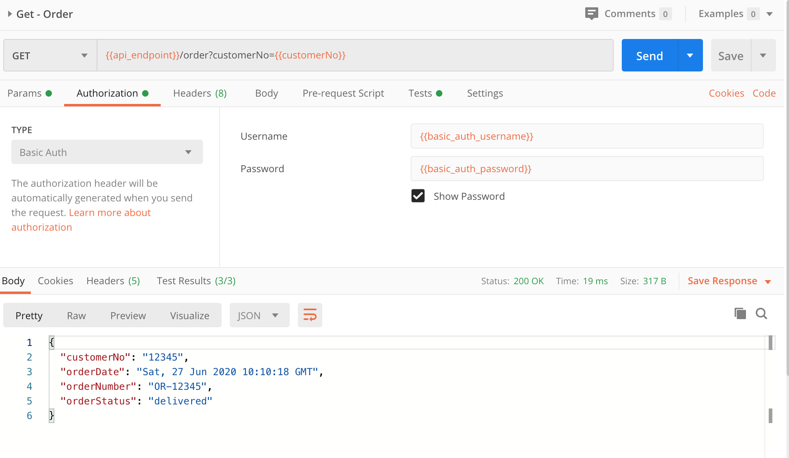
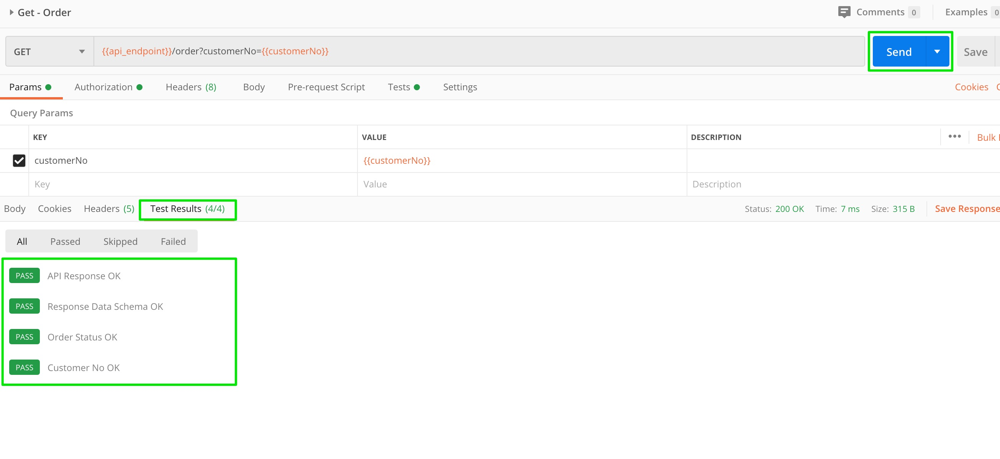

# mock-order-api

## Prerequisite

* Python 3.7+

## Setup
Clone this repository,

```
git clone https://github.com/abhishektiwari/mock-order-api.git
cd mock-order-api
```

Create virtualenv,

```
python -m venv venv
```

Then activate `virtualenv` and install requirements,

```
source venv/bin/activate
pip install -r requirements-dev.txt
```

Set environment variables,
```
export FLASK_APP=api.py
export FLASK_ENV=development
```

## Add Config
Create a `.env` file and add following configs (see `.sample-env`),

```
BASIC_AUTH_USERNAME=<your-username>
BASIC_AUTH_PASSWORD=<your-password>
```

## Run flask

```
flask run
```

## Test using Postman
You will need [Postman](https://www.postman.com/downloads/) app installed locally. Postman collection is included in this repository. Import the collection in your Postman, setup environment variables `api_endpoint` (i.e. http://localhost:5000), `customerNo` and basic authentication `username`/`password`. 

### Set Postman environment variables



### Run API Tests
Click send and review response `Body`.


Or `Test Results`


## Deploy to Heroku
One-click deploy to Heroku. You will need a Heroku account which you can create for free.

<a href="https://heroku.com/deploy?template=https://github.com/abhishektiwari/mock-order-api.git">
  
</a>